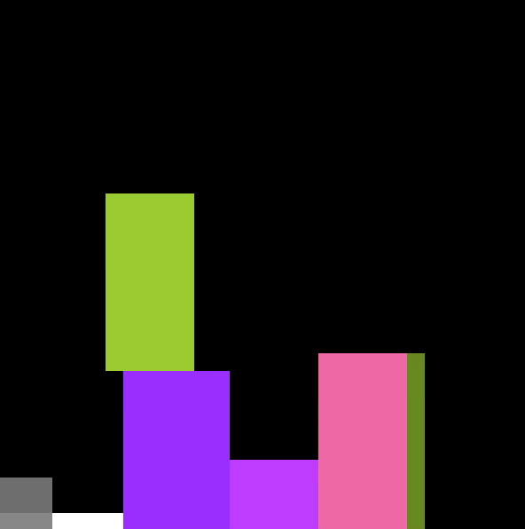

# bin-packing-env
A reinforcement learning environment for bin packing with simple GUI. very light, flexible environment based on parameters.



## Motivation
There are many papers on this 2d bin packing problem but there is no source code for those experiments. Besides there are various assumptions for each and it was so simple to compare with real world problem so that I made my own bin packing problem. Even if it is 2 dimensional bin packing problem, it is way more difficult than other 2d bin packing problems. but you can control the difficulty of it based on enviroment parameters below.

For example, I added some constraints below unlike other 2d bin packing problems.
- 놓일 BIN의 아래 맞닿는 Bin들의 총 지지 단면적 임계치 설정 (LOAD_WIDTH_THRESHOLD)
- 아래 BIN들의 하중의 제약이 있는 점을 착안하여(BIN마다 WEIGHT속성을 주어 새로 쌓이는 BIN들이 WEIGHT가 더 크면 못 쌓게함)
- 2D가 아닌 3D 상황을 감안하여 물건이 쌓을때 상단에 어떤 물체가 있으면 쌓지 못하게 하였음 (BIN 선택시 빈 공간 파악 필요)
- 당연히 BIN의 쌓는 위치에서의 크기가 팔레트 면적을 벗어나면 당연히 쌓지 못함

## Environment
You can define below parameters on config.py 

| Category | Parameter | Type | Default | Range | Etc |
|----------|-----------|------|-------|-----|-----|
| GUI        | WINDOWS_POS_X         	| int    | 10  | 0 ~  maxiumum x of screen |  x value of the screen   |
| GUI        | WINDOWS_POS_X         	| int    | 10  | 0 ~ maximum y of screen    |  y value of the  screen  |
| ENV       | RENDER         		| bool |  True    |  True or False   | display pallete status on the screen  |
| ENV       | TICK_INTERVAL         	| int     |  20      |  0~100   | the interval of render, the less it is the faster the render speed is    |
| ENV       | ROW_COUNT         	|    int   |   100    |   1 ~   | the total numbef of rows  |
| ENV       | COL_COUNT         	|    int   |   100    |   1 ~  |  the total numbef of columns  |
| ENV       | CELL_SIZE         		|    int   |     5   |  1 ~    |  the size of each cell |    
| ENV       | BIN_MAX_COUNT         	|    int   |    100   | 1 ~    |  total number of bins    |
| ENV       | EPISODE_MAX_STEP         	|    int   |   100   | 1 ~    | maximum step of each episode |
| ENV       | BIN_MIN_X_SIZE 		|   int    |   1    |  1 ~   | the min value of x of each bin |
| ENV       | BIN_MIN_X_SIZE  		|  int     |   1    |  1 ~   | the min value of x of each bin |
| ENV       | BIN_MAX_Y_SIZE 		|  int     |   10  |  1 ~   | the min value of x of each bin |
| ENV       | BIN_MAX_Y_SIZE 		| int      |   10  |  1 ~   | the min value of x of each bin |
| ENV       | BIN_MIN_W_SIZE 		|   int    |   1  |  1 ~   | the min value of x of each bin |
| ENV       | BIN_MAX_W_SIZE 		|   int    |   10  |  1 ~   | the min value of x of each bin |
| Agent    | N_EPISODES         	|    1    |   100000  |  1 ~   | the total number of episode for training |
| Agent    | LOAD_WIDTH_THRSHOLD    |  float    |  0.8    |  0 ~ 1   | the minimum percentage of width of bins below  to be placed |
| Agent     | DISCOUNT_FACTOR_REWARD         |  float    |     | 0 ~ 1    | discounted factor reward     |
| Agent     | LEARNING_RATE         		|  float    |       |  0 ~ 1   | learning rate    |
| Agent     | EPSILON         			|  float    |       |  0 ~ 1    |  epsilon  |
| Agent     | BATCH_SIZE         		|  int    |       |     |  batch size  |
| Agent     | TARGET_UPDATE_INTERVAL         	|  int    |       |     |  target update interval  |
| Agent     | GAMMA 			| float      |       |    0 ~ 1 |  gamma   |
| Agent     | REPLAY_MEMORY_SIZE         	| int      |       |     |  replay memory size  |
| Agent     | EMBEDDIN_DIM        		| int      |  100    |     | embedding dim   |
| Agent     | N_LAYERS        			| int      |  5    |     |   number of layers |


### Example of config.py
```
RENDER = True  # Pallet render 
TICK_INTERVAL = 20  # the smaller it is, the slower the game plays
CELL_SIZE = 20 # unit size of cell

PALLET SIZE 
ROW_COUNT = 30
COL_COUNT = 30

# Bins information
BIN_MAX_COUNT = 50
EPISODE_MAX_STEP = 50
BIN_MIN_X_SIZE = 1
BIN_MIN_Y_SIZE = 1
BIN_MAX_X_SIZE = 10
BIN_MAX_Y_SIZE = 10
BIN_MIN_W_SIZE = 1
BIN_MAX_W_SIZE = 1
LOAD_WIDTH_THRESHOLD = 0.8  # Ratio
```

## Reward
There are two kinds of reward mode it provided.

| MODE | Reward                               |
|------|--------------------------------------|
| 1    | 놓았던 BIN의 총 개수 / 총 BIN의 개수 |
| 2    | 총 BIN의 면적                        |


##  Provided agent
It provides a random agent not allowing same action in same episode and a DQN agent not evalutated yet.

```
bin-packing-env\agent.py
bin-packing-env\random_agent.py
```

bin-packing-env\run.py
```
from environment import PalleteWorld
from agent import *
from config import *
import logging
import pygame

if __name__ == '__main__':

    env = PalleteWorld()
    agent = PalletAgent()

    if ENV.RENDER:
        clock = pygame.time.Clock()

    for e in range(ENV.N_EPISODES):

        state = env.reset()
        d = False
        step = 0

        while True:

            while True:
                action = agent.get_action(state)
                if action not in env.previous_actions:
                    break

            logging.debug('trying {} step with {} action'.format(step, action))

            a = Action(bin_index=action, priority=np.random.choice(2), rotate=1)
            next_state, reward, done, _ = env.step(a)

            if ENV.RENDER:
                env.render()
                clock.tick(ENV.TICK_INTERVAL)

            if not done:
                state = next_state
            else:
                next_state = None

            agent.save_sample(state, action, next_state, reward)

            state = next_state

            agent.optimize_model()

            step += 1
            if done or step == ENV.EPISODE_MAX_STEP:
                logging.debug('episode {} done..'.format(e))
                break

        if e % AGENT.TARGET_UPDATE_INTERVAL == 0:
            agent.synchronize_model()

    logging.debug('Complete')
```

## State 
    - Each episode's total bin index's list where each item consists of bin's width, bin's hight and loadble weight.
    - Placed all bins' location history on its pallete from starting epsiode 

## Action
There are three actions. 
    - Bin's index
    - decide whether or not x axis or y axis for search priority 
    - whether or not rotate the bin

For the first time, I tried defining action of the agent with x, y value, but considering the fact that each palette size is defined too differently and the number of cases is too difficult, the problem itself is too difficult. Inevitably, deciding exact location for bin to be placed is handled by the code. Instead, the agent can choose priority between searching over x axis or seraching over y axis. And the agent can decide action with its bin index, and whether or not it is rotated which means that it changes the bin's width and height each other. 


##  Plan
    - Support environement to allow learning with multiple actors by supporting loading it on each thread 
    - Build and Deploy (setup.py & pip install)
    - 물류 문제처럼 팔레트가 여러개 있다고 가정 
    - N개 이상 팔레트가 있다하고, 그만큼의 BIN들이 주고나서 N개의 팔렛트를 채울때까지 하나의 에피소드로 묶음
    - 다른 알고리즘과 비교 검증시를 위해서 Random으로 BIn을 생성도 하지만 별도의 csv로 읽어서 그 기준으로 생성하게 변경
    - DQN Agent 알고리즘 만들고 간단한 환경에서 학습 가능한지 돌려볼 계획
    - pytorch TensorboardX를 만들어서 간단한 실험결과를 넣어 튜토리얼 작성
